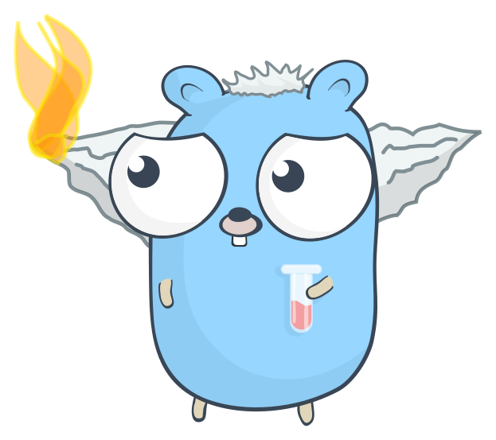

# Golang 101

__Lorenzo Zaar__


---

# Sobre mim

- Idade: 27 anos. 
- Formação: 
	- CST em Análise e Desenvolvimento de Sistemas (2022).  
    
	- Curso de Especialização Docência na Educação Profissional e no Ensino Técnico (início 2024). 
- Experiência com e-commerce, design de sites e gerenciamento de projetos.


___

# Mas o que é o Go ?

Go é uma linguagem *compilada*, *fortemente tipada*, *multi-threaded* e *garbage collected*. Ela foi criada por Rob Pike, Robert Griesemer e Ken Thompson, que na época eram engenheiros na Google, a linguagem foi criada por alguns desafios de desenvolvimento que os autores estavam sofrendo, como *compilação e execução de código eficiente* além de *facilidade de desenvolvimento*


___

O Design começou em meados de 2007 como um projeto 20% na Google, na medida que a criação progrediu, outros engenheiros se juntaram ao esforço. Sua primeira versão considerada estável lançou em Março de 2012.

___


# Instalando o Go


A versão estável atual é a 1.24.3, o repositório oficial dos binários fica em
## https://go.dev/dl/
com versões para Windows, Linux e Mac

---

# Instalando o Go
## Instruções para Linux

```
	$ rm -rf /usr/local/go && tar -C /usr/local -xzf go1.24.3.linux-amd64.tar.gz
	# deletando qualquer versão instalada em /usr/local/go
	# extraindo o binário em /usr/local
	
	# exportar path para o seu .bashrc
	export PATH=$PATH:/usr/local/go/bin
	
	$ go version  # deve retornar a versão instalada
	# ex. go version go1.24.2 linux/amd64
```


___


# Todo mundo pronto? 

___

# Estrutura Inicial

Crie uma pasta vazia, dentro dessa pasta, rode o comando

```bash
go mod init _nome_da_pasta_
```

___

# Estrutura Inicial

Projetos em Go não usam uma estrutura padrão, mas é de boa prática manter tudo dentro de uma pasta ```/src``` na pasta raiz do projeto.

Crie a pasta `/src` e dentro dela, o arquivo `main.go` 


```
projeto/
├── go.mod  
└── src  
   └── main.go
```


___

# Hello world!

O Go usa módulos para suas funcionalidades, para imprimir informações no terminal utilizamos o pacote `fmt`


---


# Sintaxe

Como vimos antes,  uma das considerações era a facilidade de desenvolvimento, por isso, a sintaxe do Go é muito amigável


___

# Declaração de variáveis e constantes
Declaração de variáveis existem em dois tipos: 
_"normais"_ e _"curtas"_. Constantes somente são declaradas da maneira normal


```go
func main () {
	// Declaração de constante
	const Pi float64 = 3.14159265358979323846

	var x int
	x = 3
	// Declarações "curtas" usam := para inferir o tipo, declarar e atribuir.
	y := 4
}
```

___ 

# Controle de fluxo

Instruções de `if` e `else if` exigem o uso de chaves, mas não requerem parênteses.

```go
func main () {
	
	if true {
		fmt.Println("desse jeito")
	} else if false {
		//
	} else {
		//
	}
	
}
```

___
# Switches
Para desenvolvedores que preferem switches ao inves de cadeias de if else, switches no Go não requerem que exista um break no fim dos cases, ja que esses não fazem o "fall through"

```go
func main () {
    x := 1
    switch x {
    case 0:
    case 1:
        fmt.Println("x é 1")
    case 2:
        // esta linha só é executada se e só se x=2
    }
}
```


____
# Loops

Loops no go, igual os ifs e switches também não precisam de parenteses, e uma peculiaridade que destaca o go de outras linguas, é a inexistencia do `while`

```go
	
    for x := 0; x < 3; x++ {
        fmt.Println("iteração", x)
    }
    for { // ciclo infinito
        break    // mentira
        continue // o ciclo nunca é executado
    }	
```

___
# Tipos de dados

As especificações de tipos no Go são divididas em 4 tipos:

- Básico
	- Números, Strings, Booleans
- Tipos Agregados
	- Arrays e Structs
- Tipos Referenciais
	- Ponteiros, Slices, Maps, Funções e Canais


----
# Operações Aritméticas

## - (`+`) Adição
## - (`-`) Subtração
## - (`*`) Multiplicação

## - (`/`) Divisão 

## - (`%`) Módulo 
___

# *Exercícios!??*  

___
# *Exercícios!??*

### Exercício 1: Declaração de Variáveis e Impressão

Declare variáveis de diferentes tipos (string, int, bool) e imprima seus valores no console.

### Exercício 2: Verificador de Par ou Ímpar

Crie um programa que determine se um número é par ou ímpar e imprima o resultado.

___
# *Exercícios!??*

### Exercício 3: Recebendo Input do usuário

Crie um programa que recebe um nome e concatena esse nome na frase "Olá {nome} como você está?"

### Exercício 4: Calculadora Simples

Escreva um programa que receba dois números e realize operações aritméticas básicas (adição, subtração, multiplicação, divisão).


___
# *Exercícios!??*

### Exercício 5: FooBar

Implemente a seguinte lógica: imprima números de 1 a 100, mas para múltiplos de 3 imprima "Foo", para múltiplos de 5 imprima "Bar", e para múltiplos de ambos imprima "FooBar".

### Exercício 6: Soma de Números

Escreva um programa que calcule a soma de todos os números de 1 até n, onde n é fornecido pelo usuário.


___
# Structs 

Structs são uma coleção de campos com tipos, são uteis para agrupar dados juntos para criar registros


___
Veja o exemplo a seguir de uma struct de produto

```go
package main 

type produto struct {
	nome string
	categoria string
	quantidade int
}

func main () {
	prod := produto{nome: "Teclado USB", categoria: "Informática", quantidade: 10}
	
	fmt.Println(prod)
}
```


___
# Structs

Campos podem ser acessados diretamente usando a notação de ponto e o nome do campo dentro do struct

___

```go
package main 

import "fmt"

type produto struct {
	nome string
	categoria string
	quantidade int
}

func main () {
	prod := produto{nome: "Teclado USB", categoria: "Informática", quantidade: 10}
	
	fmt.Println(prod.nome)
	fmt.Println(prod.quantidade)
}
```

___

# *Exercícios!??*

### Exercício 7: Cadastro de Pessoas

Escreva um programa que recebe o nome, e a idade de uma pessoa, os armazena em uma struct e imprime na tela.


___


# Arrays e Slices


No Go, um array é uma lista sequencial de elementos de um determinado comprimento

```go
package main

import "fmt"

func main() {
	// inicializando um array 
	// com 5 elementos de comprimento
	var a [5]int
	
	// setando um valor
	a[0] = 100
	
	// pegando um valor
	fmt.Println(a[0])
}
```


---

# Arrays e Slices

É mais típico usar uma slice ao inves de um array, pois ela da uma interface mais poderosa para sequencias do que arrays. Diferente de arrays, um slice pode ser criado vazio, sem elementos, com seu valor sendo igual a `nil` e seu tamanho sendo igual a `zero`.


---

```go
package main

import (
    "fmt"
    "slices"
)

func main() {
	var novoSlice []string
	
    fmt.Println("slice:", novoSlice)
    fmt.Println("Igual a nil:" novoSlice == nil)
    fmt.Println("Tamanho igual a zero:", len(novoSlice) == 0)
}
```

---

Para criar uma slice não-vazia,  usamos a função `make`, por padrão a capacidade de um slice é igual ao comprimento inicial 

```go
package main

import (
	"fmt"
	"slices"
)

func main() {
	// slice com 3 de comprimento e 3 de capacidade
	maisUmSlice := make([]string, 3)
	
	//slice com 3 de comprimento e 10 de capacidade
	maisUmNovoSlice := make([]string, 3, 10)
	
    fmt.Println(
	    "elemento:", maisUmSlice, 
	    "comprimento:", len(maisUmSlice), 
	    "capacidade:", cap(maisUmSlice)
	)
}
```


___
# *Mais Exercícios!??*

### Exercício 8: Criação de arrays

Crie um array de 5 numeros inteiros, coloque valores em cada elemento, e imprima o array inteiro

### Exercício 9: Soma de arrays

Calcule e imprima a soma de todos os elementos em um array de inteiros

___

# *Mais Exercícios!??*

### Exercício 10: Ache o valor máximo e mínimo

Ache o valor máximo e valor mínimo em um array de números inteiros, imprima esses valores

### Exercício 11: Checagem de elemento

Escreva uma função que checa se um elemento dado existe dentro de um array

___
# Maps

Maps diferentemente de arrays ou slices, são uma coleção de chave e valor, chamados de dicts ou hashes em outras linguagens.

```python
frutas = {  
  1: "Banana",  
  2: "Laranja"  
}  
print(frutas)
```

```rust
let mut frutas: HashMap<i32, String> = HashMap::new();

frutas.insert(1, String::from("Banana"));
frutas.insert(2, String::from("Laranja"));

println!("{:?}", frutas)
```

___ 

# Maps 

Criar um map é similar a criação de slices, com as únicas diferenças sendo de declarar o tipo da chave e o tipo do valor.

```go
package main

import (
    "fmt"
)

func main() {
	map := make(map[int]string)
	map[1] = "Banana"
	map[2] = "Laranja"
	fmt.Println(map)
}
```

___

