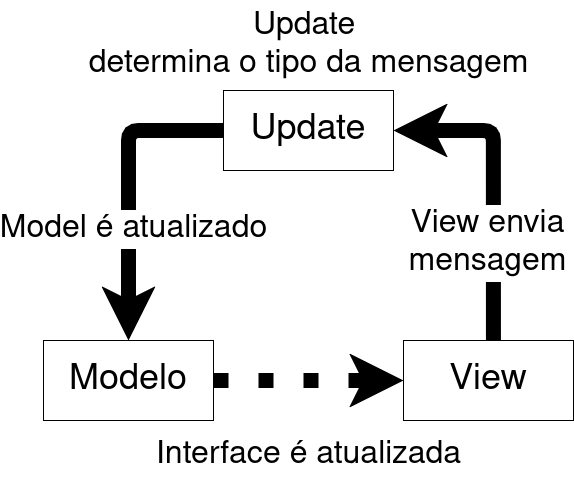

# TUIs com Golang e Bubbletea

__Lorenzo Zaar__

___

# Afinal, o que é um TUI?

TUI (Terminal User Interface),  como seu nome insinua, é uma interface visual que permite aos usuários interagir com programas ou sistemas operacionais através de um layout visual em uma linha de comando, geralmente usando caracteres ASCII ou Unicode para criar elementos visuais como caixas, menus e botões.

As TUIs representam uma evolução das Comand Line Interfaces (CLI), oferecendo uma experiência mais visual e interativa, mas ainda baseada em texto em vez de elementos gráficos como nas interfaces gráficas do usuário (GUI).


___

# Exemplos de TUIs


- htop / btop
- neofetch
- nano
- bluetui

# Alguns TUIs criados com bubletea

- superfile
- tetrigo

___

# TUIs

TUIs são especialmente utéis em ambientes sem qualquer motor gráfico, como por exemplo, servidores na nuvem, ou sistemas operacionais embarcados.


___

# Bubbletea

Bubbletea é um framework para o desenvolvimento de TUIs, criado em golang, [sua primeira versão estável foi lançada em Agosto de 2024][https://github.com/charmbracelet/bubbletea/releases/tag/v1.0.0].

Seu design é baseado nos paradigmas da [Arquitetura ELM][https://guide.elm-lang.org/architecture/].
___

___

# Seu primeiro TUI

Primeiro vamos criar um exemplo básico, um simples contador de quantas vezes o usuário apertou a barra de espaço


___

# Importando o framework


Igual vimos anteriormente, módulos devem ser importados dentro de uma declaração `import`, como o bubbletea não faz parte dos módulos nativos do Go, ele é importado usando um nome escolhido pelo desenvolvedor, e a url aonde o módulo é hospedado

```go
package main

import (
	"fmt"
	"os"
	
	tea "github.com/charmbracelet/bubbletea"
)

```

___
# Model

O Model na arquitetura ELM, representa o estado atual da aplicação, todos os aspectos da aplicação necessariamente precisam ser declarados no model, para garantir que nenhum aspecto do estado seja perdido.

```go
// representação do modelo 
type model struct {
	contagem int
	fechando bool
}
```

___
# Model

Esse model também precisa de um estado inicial, uma boa prática é criar uma função que inicia uma instância do model com valores padrões.

```go
func modeloInicial() model {
	return model{
		contagem: 0,
		fechando: false,
	}
}
```


___

# Mensagens

Mensagens são como nossa aplicação determina o que precisa ser feito, como nossa aplicação somente tem um evento, só precisamos declarar o evento como um tipo vazio

```go
type(
	increment struct{}
)
```

___

# Updates

A função de update é o núcleo central da nossa aplicação, a função recebe as mensagens, e atualiza o modelo de acordo com a mensagem.

___

```go
func (m model) Update(msg tea.Msg) (tea.Model, tea.Cmd) {
	switch msg := msg.(type) {
		case tea.KeyMsg:
			switch msg.String() {
			case "q", "ctrl+c":
				m.fechando = true
				return m, tea.Quit
			case " ":
				return m, func() tea.Msg { return increment{} }
			}
		case increment:
			m.contagem++
	}
	return m, nil
}
```

___

# View

Essa função renderiza a interface gráfica baseada no estado atual do model.

```go
func (m model) View() string {
	if m.fechando {
		return fmt.Sprintf("Contagem Final: %d!\n", m.contagem)
	}
	
	s := fmt.Sprintf("\n 🔢 Contador: %d\n\n", m.contagem)
	s += "Espaço: Aumentar valor\n"
	s += "Q: Fechar\n\n"
	
	return s
}
``` 

___
# Init

A função  `Init` retorna o comando inicial para a aplicação, aqui poderiamos por exemplo, inicializar uma conexão com um banco de dados, ou determinar o ambiente que a aplicação esta sendo inicializada. Nesse exemplo, trocamos o titulo da janela.

```go
func (m model) Init() tea.Cmd {
	return tea.SetWindowTitle("Contador - Bubble Tea")
}
```

___
# Main

Na função principal, incializamos o model usando a função `Init()`, inicializamos uma instância do programa usando o Bubble Tea.

```go
func main() {
	// Crie e rode o programa
	p := tea.NewProgram(modeloInicial())
	if _, err := p.Run(); err != nil {
		fmt.Printf("Erro ao inicializar: %v\n", err)
		os.Exit(1)
	}
}
```


___

# Quase lá!

Ao rodar o arquivo nesse estado atual, iremos receber o seguinte erro:

```bash
no required module provides package github.com/charmbracelet/bubbletea; to add it:
        go get github.com/charmbracelet/bubbletea
```

O erro já nos dá a solução, precisamos instalar o pacote do bubbletea usando o comando
`go get github.com/charmbracelet/bubbletea` 

___

# Um exemplo mais avançado

Iremos criar um programa de lista de compras, com opções ja pré-criadas, o usuário poderá checkar e descheckar items dessa lista de compras

